# Built-in M2 Benchmark Report

## Scope

This report compares the active C++ search pipeline against the repo's built-in Macaulay2 baseline on the same machine.

- C++ side: `build/bin/bad_one_generator`, which generates degree sequences and tests them with `test_conjs`.
- M2 side: the built-in-generation baseline used by `scripts/benchmark_against_m2_built_in.sh`, i.e. built-in subset generation plus `pureBetti`, followed by BEH/LLBC checks written in M2.

Artifacts:

- Reproduction script: [scripts/run_builtin_benchmark_matrix.sh](/home/wolve/projects/boij-soderberg-engine-repo/scripts/run_builtin_benchmark_matrix.sh)
- SVG graph for fixed codimension 5: [data/processed/benchmarks/codim5_runtime_memory_vs_n.svg](/home/wolve/projects/boij-soderberg-engine-repo/data/processed/benchmarks/codim5_runtime_memory_vs_n.svg)
- Linear-scale SVG for fixed codimension 5: [data/processed/benchmarks/codim5_runtime_memory_vs_n_linear.svg](/home/wolve/projects/boij-soderberg-engine-repo/data/processed/benchmarks/codim5_runtime_memory_vs_n_linear.svg)
- Threshold sweep script: [scripts/run_until_m2_threshold.sh](/home/wolve/projects/boij-soderberg-engine-repo/scripts/run_until_m2_threshold.sh)
- Extended threshold CSV (`c=7` until M2 > 300s): [data/processed/benchmarks/codim7_until_m2_300s.csv](/home/wolve/projects/boij-soderberg-engine-repo/data/processed/benchmarks/codim7_until_m2_300s.csv)
- Linear-scale SVG for threshold sweep: [data/processed/benchmarks/codim7_runtime_memory_vs_n_linear_until5min.svg](/home/wolve/projects/boij-soderberg-engine-repo/data/processed/benchmarks/codim7_runtime_memory_vs_n_linear_until5min.svg)
- Summary CSV: [data/processed/benchmarks/builtin_m2_matrix.csv](/home/wolve/projects/boij-soderberg-engine-repo/data/processed/benchmarks/builtin_m2_matrix.csv)
- Raw logs: [data/processed/benchmarks/builtin_m2_logs](/home/wolve/projects/boij-soderberg-engine-repo/data/processed/benchmarks/builtin_m2_logs)

## Method

I ran this benchmark matrix:

- `c=5, d=14`
- `c=5, d=16`
- `c=6, d=15`
- `c=5, d=19`
- `c=6, d=17`
- `c=7, d=16`
- `c=6, d=20`
- `c=7, d=18`

Definitions:

- `n` = number of candidate degree sequences generated and tested in that run.
- Runtime in the table below uses the program-reported total time (`Finished all tests in ... seconds`), not `/usr/bin/time` wall time, because the fastest C++ runs are short enough that wall-time rounding gets coarse.
- Memory uses `/usr/bin/time` `maxrss_kb`.

## Headline Results

- Across these 8 runs, the C++ implementation was on average `33.24x` faster than the built-in M2 baseline.
- Across the same runs, the C++ implementation used `20.49x` less peak resident memory on average.
- Speedup ranged from `26.06x` to `46.19x`.
- Memory reduction ranged from `15.17x` to `23.73x`.

## Results Table

| Run `(c,d)` | `n` | C++ total sec | M2 total sec | Speedup | C++ maxrss | M2 maxrss | Memory ratio |
| --- | ---: | ---: | ---: | ---: | ---: | ---: | ---: |
| `(5,14)` | 2,002 | 0.005967 | 0.194968 | 32.67x | 4,224 KB | 100,224 KB | 23.73x |
| `(5,16)` | 4,368 | 0.010628 | 0.293293 | 27.60x | 4,224 KB | 100,224 KB | 23.73x |
| `(6,15)` | 5,005 | 0.012938 | 0.597653 | 46.19x | 4,416 KB | 99,152 KB | 22.45x |
| `(5,19)` | 11,628 | 0.023919 | 0.798032 | 33.36x | 4,800 KB | 99,644 KB | 20.76x |
| `(6,17)` | 12,376 | 0.029016 | 1.105390 | 38.10x | 4,800 KB | 99,636 KB | 20.76x |
| `(7,16)` | 11,440 | 0.047350 | 1.565780 | 33.07x | 4,792 KB | 99,256 KB | 20.71x |
| `(6,20)` | 38,760 | 0.114040 | 3.293610 | 28.88x | 6,548 KB | 99,340 KB | 15.17x |
| `(7,18)` | 31,824 | 0.124794 | 3.251650 | 26.06x | 5,972 KB | 99,436 KB | 16.65x |

## Runtime Chart

```mermaid
xychart-beta
    title "Program-reported total runtime by run"
    x-axis ["5,14 (2002)","5,16 (4368)","6,15 (5005)","5,19 (11628)","6,17 (12376)","7,16 (11440)","6,20 (38760)","7,18 (31824)"]
    y-axis "seconds" 0 --> 3.5
    bar "C++" [0.005967,0.010628,0.012938,0.023919,0.029016,0.047350,0.114040,0.124794]
    bar "M2 built-in" [0.194968,0.293293,0.597653,0.798032,1.105390,1.565780,3.293610,3.251650]
```



## Fixed-Codimension SVG

For the specific visualization you asked for, with codimension fixed and `n` on the x-axis, open:

- [data/processed/benchmarks/codim5_runtime_memory_vs_n.svg](/home/wolve/projects/boij-soderberg-engine-repo/data/processed/benchmarks/codim5_runtime_memory_vs_n.svg)
- [data/processed/benchmarks/codim5_runtime_memory_vs_n_linear.svg](/home/wolve/projects/boij-soderberg-engine-repo/data/processed/benchmarks/codim5_runtime_memory_vs_n_linear.svg)

That SVG has two color-coded panels for codimension `5`:

- runtime vs `n` for C++ and built-in M2,
- peak memory vs `n` for C++ and built-in M2.

## Extended Threshold Sweep

I also ran an extended fixed-codimension sweep at `c=7`, increasing max degree until the built-in M2 runtime exceeded `300` seconds.

Result:

- the first run exceeding 5 minutes was `c=7, d=32`
- candidate sequences tested: `3,365,856`
- C++ total time: `13.0959s`
- M2 total time: `415.285s`
- C++ maxrss: `240,400 KB`
- M2 maxrss: `1,290,816 KB`

Artifacts:

- CSV: [data/processed/benchmarks/codim7_until_m2_300s.csv](/home/wolve/projects/boij-soderberg-engine-repo/data/processed/benchmarks/codim7_until_m2_300s.csv)
- linear-scale SVG: [data/processed/benchmarks/codim7_runtime_memory_vs_n_linear_until5min.svg](/home/wolve/projects/boij-soderberg-engine-repo/data/processed/benchmarks/codim7_runtime_memory_vs_n_linear_until5min.svg)

## Memory Chart

```mermaid
xychart-beta
    title "Peak resident memory by run"
    x-axis ["5,14 (2002)","5,16 (4368)","6,15 (5005)","5,19 (11628)","6,17 (12376)","7,16 (11440)","6,20 (38760)","7,18 (31824)"]
    y-axis "maxrss_kb" 0 --> 105000
    bar "C++" [4224,4224,4416,4800,4800,4792,6548,5972]
    bar "M2 built-in" [100224,100224,99152,99644,99636,99256,99340,99436]
```



## Same-`n` / Different-Shape Cases

These are the most interesting runs if the goal is to show that `n` alone does not explain cost.

### `(5,19)` vs `(7,16)`

- `n` is almost identical: `11,628` vs `11,440`.
- C++ total time: `0.023919s` vs `0.047350s`.
- M2 total time: `0.798032s` vs `1.565780s`.
- Even with slightly fewer sequences, the `c=7` case is about `1.98x` slower in C++ and `1.96x` slower in M2.

Interpretation:

- The cost per sequence rises materially with codimension, which is exactly what you would expect from the fraction-building, cancellation, and denominator bookkeeping in the conjecture test.

### `(5,16)` vs `(6,15)`

- `n` is close: `4,368` vs `5,005`.
- C++ total time rises only `1.22x`.
- M2 total time rises `2.04x`.

Interpretation:

- The codimension increase already shows up at modest sizes, and the M2 built-in path is more sensitive to that jump than the C++ path.

### `(6,20)` vs `(7,18)`

- `n` actually drops from `38,760` to `31,824`.
- C++ total time still rises from `0.114040s` to `0.124794s`.
- M2 total time stays almost flat: `3.293610s` vs `3.251650s`.

Interpretation:

- This is a clean example where the `c=7` case is more expensive for the C++ tester despite having fewer candidate sequences.
- It suggests the direct-conjecture logic is strongly influenced by codimension-dependent per-sequence work, not just the number of sequences.

## Takeaways

- The C++ engine is consistently and substantially faster than the built-in M2 baseline for this workload.
- The largest measured gains come from conjecture testing, not just sequence generation.
- M2 memory stayed roughly pinned near `~99-100 MB` across the matrix, while C++ stayed in the `~4-6.5 MB` range.
- `n` is not the whole story. Codimension changes can nearly double runtime even when the number of tested sequences is almost unchanged.

## Reproduction

From repo root:

```bash
make
bash scripts/run_builtin_benchmark_matrix.sh
column -s, -t < data/processed/benchmarks/builtin_m2_matrix.csv
```
